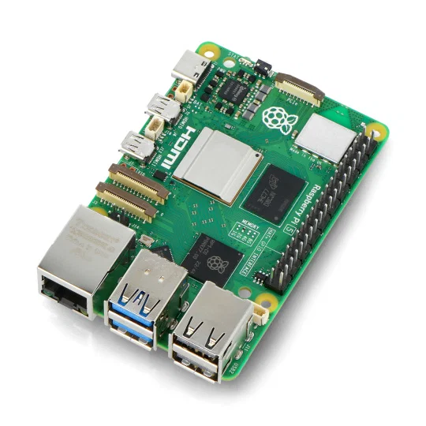
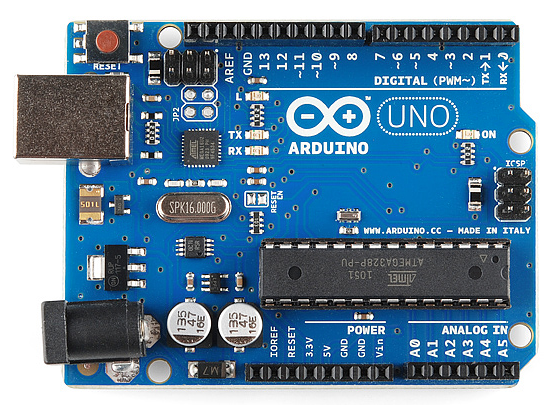
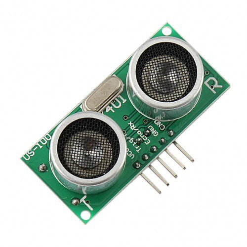
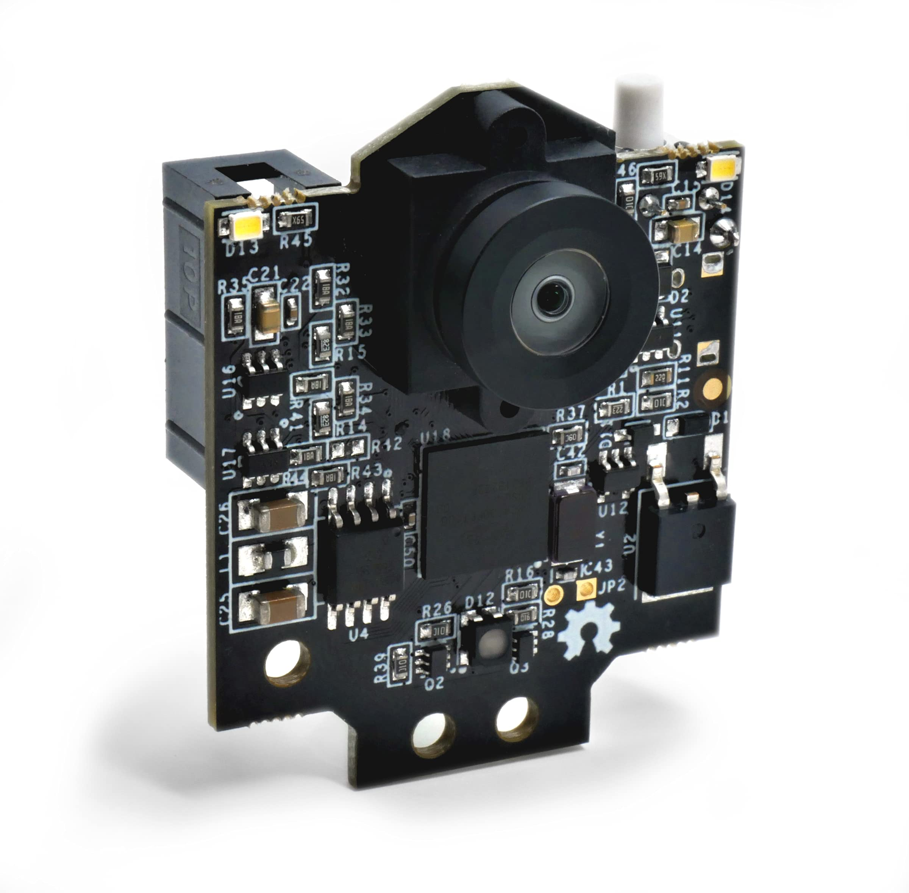
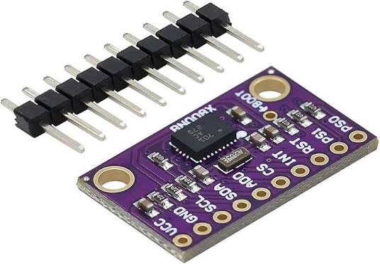
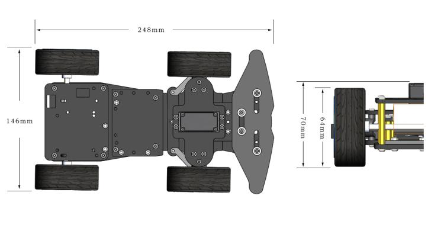

<div align="center">

# WRO Future Engineers

</div>


<a id="challenge"></a>
##  About the Competition (The Challenge)

**WRO Future Engineers** is a category within the **World Robot Olympiad (WRO)**, an international robotics competition. It is a self-driving car challenge where students aged 14 to 19 design, build, and program a model car equipped with electromechanical components — such as sensors, cameras, and microcontrollers — to autonomously navigate a track and avoid obstacles, without any remote control or human intervention.

### Challenges

The competition consists of two main challenges:

| Challenge | Description |
|---|---|
| **Open Challenge** | The car completes a set number of laps around the track fully autonomously. |
| **Obstacle Challenge** | The car must avoid colored pillars (red and green) and perform additional tasks such as parallel parking. |

### Evaluation Criteria

Teams are evaluated on:
-  Vehicle performance on the track
-  Engineering documentation (design process, code, decisions)
-  Judges' interview (explaining design choices and problem-solving approach)

---

## Table of Contents
- [About the Competition (The Challenge)](#challenge)
- [Team Members](#team)
- [Bill of Materials](#code-for-each-component)
- [Power Consumption](#power-consumption)
- [License](#license)
---
<a id="team"></a>
<div align="center">

#  Team Members

</div>

<h3>Rayna Rino</h3>

<p><b>Age:</b> 14</p>
<p><b>Email:</b> rinoorayan14@gmail.com</p>
<p><b>School:</b> British Scientific School</p>
<p><b>GitHub:</b> <a href="https://github.com/rayanrinoo">rayanrinoo</a></p>
<br clear="right"/>

<hr>

<h3>Othman Jaber</h3>

<p><b>Age:</b> 17</p>
<p><b>Email:</b> othmanjaber78@gmail.com</p>
<p><b>School:</b> King Talal Secondary School</p>
<p><b>GitHub:</b> <a href="https://github.com/othmanjaber">othmanjaber</a></p>
<br clear="right"/>

<hr>

<h3>Yazan Hindia</h3>

<p><b>Age:</b> 14</p>
<p><b>Email:</b> yazanhindia@gmail.com</p>
<p><b>School:</b> Mahmoud Darwish School</p>
<p><b>GitHub:</b> <a href="https://github.com/othmanjaber">othmanjaber</a></p>
<br clear="right"/>

---


<p align="center">
  <!-- Add your circuit/wiring diagram here, e.g.: -->
  <!--  -->
</p>

---

<a id="code-for-each-component"></a>
<div align="center">


##  Bill of Materials

<table width="100%">
    <thead>
        <tr>
            <th width="25%" align="left">Component Name</th>
            <th width="30%" align="center">Image</th>
            <th width="45%" align="left">Description</th>
        </tr>
    </thead>
    <tbody>
        <tr>
            <td><b>Raspberry Pi 5 (8GB)</b></td>
            <td align="center"></td>
            <td>Main processing unit of the robot, handles high-level control, vision processing, and communication with other components.</td>
        </tr>
        <tr>
            <td><b>Raspberry Pi 5 Cooler</b></td>
            <td align="center"></td>
            <td>Active cooling fan and heatsink to keep the Raspberry Pi 5 running at safe temperatures under heavy load.</td>
        </tr>
        <tr>
            <td><b>Arduino Uno</b></td>
            <td align="center"></td>
            <td>Microcontroller board used for low-level tasks such as motor control and reading sensor data in real time.</td>
        </tr>
        <tr>
            <td><b>Byte Robot Chassis Kit</b></td>
            <td align="center"></td>
            <td>Structural frame of the robot that holds all electronic and mechanical components together.</td>
        </tr>
        <tr>
            <td><b>GA25-370 DC Motor with Encoder</b></td>
            <td align="center"></td>
            <td>Geared DC motor with built-in encoder, used to drive the wheels and measure rotation for precise movement.</td>
        </tr>
        <tr>
            <td><b>US-100 Ultrasonic Sensor</b></td>
            <td align="center"></td>
            <td>Ultrasonic distance sensor used for obstacle detection and avoidance.</td>
        </tr>
        <tr>
            <td><b>Pixy2</b></td>
            <td align="center"></td>
            <td>Smart vision sensor capable of color and object detection to help the robot identify targets.</td>
        </tr>
        <tr>
            <td><b>BNO080</b></td>
            <td align="center"></td>
            <td>9-axis IMU sensor providing orientation, rotation, and motion data for stabilization and navigation.</td>
        </tr>
        <tr>
            <td><b>Chassis Assembly Diagram</b></td>
            <td align="center"></td>
            <td>Reference diagram showing how the chassis components are assembled together.</td>
        </tr>
    </tbody>
</table>

---

## Power Consumption

<table width="100%">
    <thead>
        <tr>
            <th align="left">Component</th>
            <th align="center">Voltage</th>
            <th align="center">Current (typ)</th>
            <th align="center">Power</th>
        </tr>
    </thead>
    <tbody>
        <tr>
            <td>Raspberry Pi 5 (8GB)</td>
            <td align="center">5 V</td>
            <td align="center">~1.0–3.0 A</td>
            <td align="center">~5–15 W</td>
        </tr>
        <tr>
            <td>Raspberry Pi 5 Active Cooler</td>
            <td align="center">5 V</td>
            <td align="center">~0.10 A</td>
            <td align="center">~0.5 W</td>
        </tr>
        <tr>
            <td>Arduino Uno</td>
            <td align="center">5 V (7–12 V input)</td>
            <td align="center">~0.05 A</td>
            <td align="center">~0.25 W</td>
        </tr>
        <tr>
            <td>GA25-370 DC Motor with Encoder (×2)</td>
            <td align="center">6–12 V</td>
            <td align="center">~0.30–0.50 A (each)</td>
            <td align="center">~1.8–6 W (each)</td>
        </tr>
        <tr>
            <td>US-100 Ultrasonic Sensor</td>
            <td align="center">5 V</td>
            <td align="center">~15 mA</td>
            <td align="center">~0.075 W</td>
        </tr>
        <tr>
            <td>Pixy2 Camera</td>
            <td align="center">5 V</td>
            <td align="center">~140 mA</td>
            <td align="center">~0.7 W</td>
        </tr>
        <tr>
            <td>BNO080 IMU</td>
            <td align="center">3.3 V</td>
            <td align="center">~15 mA</td>
            <td align="center">~0.05 W</td>
        </tr>
    </tbody>
</table>

---


<a id="license"></a>
<div align="center">

#  License

</div>


```
Copyright (c) 2026 HASEM

Permission is hereby granted, free of charge, to any person obtaining a copy
of this software and associated documentation files (the "Software"), to deal
in the Software without restriction, including without limitation the rights
to use, copy, modify, merge, publish, distribute, sublicense, and/or sell
copies of the Software, and to permit persons to whom the Software is
furnished to do so, subject to the following conditions:

The above copyright notice and this permission notice shall be included in all
copies or substantial portions of the Software.

THE SOFTWARE IS PROVIDED "AS IS", WITHOUT WARRANTY OF ANY KIND, EXPRESS OR
IMPLIED, INCLUDING BUT NOT LIMITED TO THE WARRANTIES OF MERCHANTABILITY,
FITNESS FOR A PARTICULAR PURPOSE AND NONINFRINGEMENT. IN NO EVENT SHALL THE
AUTHORS OR COPYRIGHT HOLDERS BE LIABLE FOR ANY CLAIM, DAMAGES OR OTHER
LIABILITY, WHETHER IN AN ACTION OF CONTRACT, TORT OR OTHERWISE, ARISING FROM,
OUT OF OR IN CONNECTION WITH THE SOFTWARE OR THE USE OR OTHER DEALINGS IN THE
SOFTWARE.

```
